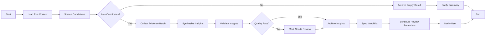

# 统一数据网关、结构化 Intelligence 与 LangGraph 投研流水线实施方案（2026-03-08）

## 1. 文档目的

本文档用于将以下三项能力建设落为可执行的工程计划，并作为后续迭代、拆分任务、评审数据模型与验收的统一依据：

1. 将 `python_services` 从“AkShare 包装层”升级为“统一数据网关”
2. 增强 `intelligence` 限界上下文，让每个筛选结果都具备结构化的投研解释
3. 使用 LangGraph 将“筛选—解释—归档—提醒”改造成真正的流水线工作流

本方案严格遵循当前仓库既有技术约束：

- 前端与主业务编排：Next.js App Router + TypeScript + tRPC + Prisma
- 金融数据微服务：Python FastAPI
- 分层方式：DDD（domain / application / infrastructure）
- 工作流编排：LangGraph.js

---

## 2. 当前现状与主要问题

### 2.1 `python_services` 现状

当前 Python 服务已经具备以下能力：

- 提供股票基础数据、主题资讯、候选股、公司证据等 HTTP 接口
- 对 AkShare 做了适配与部分缓存/兜底
- 已引入概念匹配、智谱 Web Search、本地规则回退等情报能力

但其本质仍偏向“接口集合”，尚未成为一个稳定的数据网关，主要问题如下：

1. **契约不统一**
   - 对外返回仍以功能接口为中心，而不是以标准数据模型为中心
   - 缺少统一的 `provider / freshness / cache hit / stale / latency` 元信息
2. **横切能力分散**
   - 缓存、降级、重试、错误语义、批处理没有沉淀为公共能力层
3. **缺少 provider 边界**
   - AkShare 适配与业务规则混在一起，后续切换或增加 provider 成本高
4. **批任务不足**
   - 缺少夜间刷新、热点预热、缺口修复等后台任务体系
5. **可观测性弱**
   - 无法系统回答“哪些接口慢、哪些数据频繁 stale、哪些 provider 经常失败”

### 2.2 `intelligence` 现状

当前 `intelligence` 已具备新闻、候选股、公司证据等类型定义与应用服务，但仍偏“工作流输入/输出数据类型”，缺少真正的领域对象。主要问题如下：

1. **没有结构化投资观点模型**
   - 缺少 thesis、risk、catalyst、review plan 等核心对象
2. **筛选结果与投研解释割裂**
   - `screening` 输出的是分数与命中条件
   - `intelligence` 还没有把这些结果沉淀为“可持续追踪的研究对象”
3. **无法版本化追踪**
   - 观点更新、证据变化、复评结果还没有历史版本机制
4. **提醒机制未建立**
   - 复评日期没有成为系统任务，只是分析结果中的隐含信息

### 2.3 LangGraph 现状

当前系统已使用 LangGraph，但整体仍是“节点数组 + 顺序 for-loop 执行”的模式，离真正的图工作流还有距离：

1. **缺少分支**
   - 没有候选标的、证据不足、低置信度等情况都没有走分叉逻辑
2. **缺少归档节点与提醒节点**
   - 工作流结束即返回结果，尚未系统化做结构化落库与提醒调度
3. **Graph 还未成为统一运行时抽象**
   - 执行层对特定 graph 实现耦合较高，不利于后续扩展多个流程模板
4. **恢复语义不足**
   - checkpoint 目前主要保存状态，不足以保障“恢复后不重复归档、不重复发提醒”

---

## 3. 总体建设目标

本轮建设目标不是盲目扩大功能范围，而是把“股票筛选 → 研究解释 → 结论归档 → 后续提醒”做成一个稳定闭环。

### 3.1 核心目标

1. **统一数据网关化**
   - 让 Python 服务成为主系统唯一的数据接入层
2. **研究对象结构化**
   - 让每个筛选结果都能沉淀为“可解释、可追踪、可复评”的 insight
3. **工作流闭环化**
   - 让 LangGraph 负责完整流程编排，而不是仅负责一次性 Agent 调用

### 3.2 非目标

以下内容不在本轮主线范围内：

- 多市场实盘交易接入
- 多 provider 并行交易执行
- 用户自定义可视化 DAG 编辑器
- 外部 IM 通知的完整打通
- 大规模量化回测引擎建设

---

## 4. 建设原则

### 4.1 领域边界原则

- `screening`：负责筛选规则、评分、命中条件、指标值
- `intelligence`：负责把候选标的解释为结构化研究结论
- `workflow`：负责将多个领域服务串成可恢复、可观测的流程
- `python_services`：作为基础设施层的数据网关，对领域层隐藏外部数据源细节

### 4.2 事实优先原则

- 先构建结构化事实包（facts bundle）
- 再让 LLM 在事实约束内生成 thesis、风险与催化剂
- 禁止让 LLM 在缺证据的情况下直接产出强结论

### 4.3 兼容优先原则

- 旧接口先保持兼容
- 新网关能力用 `/api/v1/*` 和新 DTO 逐步导流
- 旧工作流模板保留，新增新模板灰度切换

### 4.4 恢复与幂等原则

- 任意 run 被中断后应能从 checkpoint 恢复
- 恢复后不能重复落库 insight
- 恢复后不能重复创建 reminder
- 归档与提醒节点必须具备幂等语义

---

## 5. 方案一：将 `python_services` 升级为统一数据网关

## 5.1 目标定位

将 `python_services` 从“AkShare 封装集合”升级为“标准化金融数据网关”，统一处理：

- 数据契约标准化
- provider 访问封装
- 缓存
- 限流
- 重试
- 熔断与降级
- 批量任务
- 可观测性

## 5.2 推荐目录结构

```text
python_services/
  app/
    main.py
    routers/
      market_data.py
      intelligence_data.py
      admin_jobs.py
    contracts/
      common.py
      market.py
      intelligence.py
      meta.py
    gateway/
      market_gateway.py
      intelligence_gateway.py
    providers/
      akshare/
        client.py
        mappers.py
        datasets/
          stock_spot.py
          concept_board.py
          financials.py
          news.py
    policies/
      cache_policy.py
      retry_policy.py
      rate_limit_policy.py
      circuit_breaker.py
    infrastructure/
      cache/
        memory_cache.py
        redis_cache.py
      metrics/
        recorder.py
      logging/
        request_id.py
    jobs/
      refresh_universe.py
      refresh_concepts.py
      refresh_fundamentals.py
      prewarm_hot_themes.py
      repair_missing_data.py
    services/
      concept_rules_registry.py
      zhipu_search_client.py
```

说明：

- `providers/` 只负责和外部源打交道
- `gateway/` 负责对多个 provider 输出统一数据结构
- `contracts/` 负责 API 输入输出契约，不允许把 provider 原始字段泄漏出去
- `policies/` 用于沉淀缓存、限流、重试、熔断等横切能力
- `jobs/` 负责后台批任务，不阻塞请求线程

## 5.3 标准化数据契约

### 5.3.1 通用响应包装

所有新接口建议统一为：

```json
{
  "meta": {
    "requestId": "req_xxx",
    "provider": "akshare",
    "cacheHit": true,
    "isStale": false,
    "latencyMs": 183,
    "asOf": "2026-03-08T10:00:00.000Z",
    "warnings": []
  },
  "data": {}
}
```

### 5.3.2 市场数据标准字段

统一字段建议：

- `stockCode`
- `exchange`
- `market`
- `securityType`
- `stockName`
- `industry`
- `concepts`
- `marketCap`
- `floatMarketCap`
- `turnoverRate`
- `changePercent`
- `pe`
- `pb`
- `roe`
- `eps`
- `revenue`
- `netProfit`
- `debtRatio`
- `asOf`
- `provider`

### 5.3.3 情报数据标准字段

统一字段建议：

- `theme`
- `newsItems[]`
- `candidates[]`
- `evidence[]`
- `conceptMatches[]`
- `sourceRefs[]`
- `freshness`
- `confidence`

## 5.4 缓存策略

采用 `L1 内存缓存 + L2 Redis 缓存 + stale-while-revalidate`：

### 5.4.1 缓存层级

1. **L1**：进程内缓存
   - 低延迟
   - 适合热点瞬时命中
2. **L2**：Redis
   - 跨 worker 共享
   - 适合统一缓存与恢复使用

### 5.4.2 TTL 建议

- 行情快照：`30s fresh / 120s stale`
- 主题新闻：`5m fresh / 30m stale`
- 概念匹配：`10m fresh / 2h stale`
- 基础财务：`1d fresh / 7d stale`
- 公司证据：`6h fresh / 24h stale`
- 全市场股票代码表：`1d fresh / 3d stale`

### 5.4.3 缓存 Key 规范

统一格式：

```text
gateway:v1:{dataset}:{provider}:{hash(params)}
```

示例：

```text
gateway:v1:theme_news:akshare:3a8d7d...
gateway:v1:concept_match:akshare:91cf2f...
gateway:v1:stock_snapshot:akshare:600519
```

## 5.5 限流与并发控制

### 5.5.1 入口层限流

面向调用方进行限流：

- 按用户限流：防止单用户高频刷新页面造成数据风暴
- 按 IP 限流：防止恶意请求

### 5.5.2 provider 层限流

面向 AkShare / 外部搜索进行限流：

- 使用 `Semaphore` 控制并发
- 使用 `Token Bucket` 控制单位时间请求数
- 对高成本接口单独设更严格配额

建议默认值：

- `stock spot`：并发 2~4
- `concept constituents`：并发 2
- `financial analysis`：并发 1~2
- `web search`：并发 1~2

## 5.6 重试、熔断与降级

### 5.6.1 可重试场景

仅对以下场景重试：

- 网络超时
- 临时连接失败
- 上游短暂 429 / 5xx
- HTML 结构轻微波动导致的临时解析失败
- 返回空集但历史缓存存在的场景

### 5.6.2 不可重试场景

- 参数非法
- 股票代码格式错误
- 业务上无结果
- schema 校验失败且可确认为代码 bug

### 5.6.3 重试策略

- 指数退避：`200ms → 800ms → 2000ms`
- 增加随机抖动
- 最大重试次数建议 2~3 次

### 5.6.4 熔断与降级策略

provider 连续失败达到阈值后：

1. 优先返回 fresh cache
2. 无 fresh cache 时返回 stale cache
3. stale 也无时返回 partial response
4. 最后才启用 mock fallback

要求：

- 所有降级都必须通过 `meta.warnings` 明示
- 不允许前端把 mock 数据误认为真实数据

## 5.7 批任务体系

新增 5 类后台任务：

### 5.7.1 全市场刷新任务

- 任务名：`refresh-universe`
- 内容：刷新股票代码表、名称、行业、基础映射
- 周期：每日开盘前 / 每日晚间

### 5.7.2 概念板块刷新任务

- 任务名：`refresh-concepts`
- 内容：刷新概念板块列表、概念成分股、热点概念映射缓存
- 周期：每日盘后

### 5.7.3 财务指标刷新任务

- 任务名：`refresh-fundamentals-nightly`
- 内容：刷新核心财务指标、补齐缓存缺口
- 周期：夜间批处理

### 5.7.4 热门主题预热任务

- 任务名：`prewarm-hot-themes`
- 内容：预热最近高频查询主题的新闻、候选股、证据缓存
- 周期：每小时

### 5.7.5 缺口修复任务

- 任务名：`repair-missing-data`
- 内容：修复前一天工作流中缺失的指标、证据、概念匹配
- 周期：每小时或夜间

## 5.8 API 演进策略

### 5.8.1 保持兼容

保留现有：

- `/api/intelligence/news`
- `/api/intelligence/candidates`
- `/api/intelligence/evidence/{stockCode}`
- `/api/intelligence/evidence/batch`

### 5.8.2 新增标准化接口

建议新增：

- `/api/v1/market/stocks/{stockCode}`
- `/api/v1/market/stocks/batch`
- `/api/v1/market/themes/{theme}/candidates`
- `/api/v1/intelligence/themes/{theme}/news`
- `/api/v1/intelligence/themes/{theme}/concepts`
- `/api/v1/intelligence/stocks/{stockCode}/evidence`

## 5.9 可观测性指标

必须记录：

- `provider_request_latency_ms`
- `provider_error_count`
- `cache_hit_ratio`
- `stale_fallback_ratio`
- `retry_count`
- `empty_payload_ratio`
- `batch_success_ratio`
- `concept_match_source_distribution`

---

## 6. 方案二：增强 `intelligence`，为筛选结果建立结构化研究对象

## 6.1 目标

把“候选股列表”升级为“研究对象列表”，每个结果必须包含：

- thesis（为什么值得关注）
- risks（主要风险）
- catalysts（催化剂）
- review date（下次复评日期）

## 6.2 领域边界调整

### 6.2.1 `screening` 的职责保持纯净

`screening` 只负责：

- 规则筛选
- 分数计算
- 命中条件
- 指标数值

不在 `screening` 中引入 thesis、风险、催化剂等解释性逻辑。

### 6.2.2 `intelligence` 负责结构化解释

`intelligence` 负责：

- 汇总外部证据
- 生成结构化 thesis
- 提取风险点与催化剂
- 推导复评计划
- 管理 insight 的版本与状态

## 6.3 推荐目录结构

```text
src/server/domain/intelligence/
  aggregates/
    screening-insight.ts
  entities/
    evidence-reference.ts
  value-objects/
    investment-thesis.ts
    risk-point.ts
    catalyst.ts
    review-plan.ts
    insight-quality-flag.ts
  repositories/
    screening-insight-repository.ts
    reminder-repository.ts
  services/
    insight-synthesis-service.ts
    review-plan-policy.ts
    insight-quality-service.ts
  errors.ts
  types.ts
```

## 6.4 核心领域对象

### 6.4.1 `ScreeningInsight`

表示一次筛选结果在投研语义上的结构化结论。

建议字段：

- `id`
- `userId`
- `screeningSessionId`
- `watchListId?`
- `stockCode`
- `stockName`
- `score`
- `thesis`
- `risks[]`
- `catalysts[]`
- `reviewPlan`
- `evidenceRefs[]`
- `qualityFlags[]`
- `status`
- `version`
- `createdAt`
- `updatedAt`

### 6.4.2 `InvestmentThesis`

建议字段：

- `summary`：一句话结论
- `whyNow`：为什么是现在
- `drivers[]`：核心驱动因素
- `monetizationPath`：兑现路径
- `confidence`：`high | medium | low`

### 6.4.3 `RiskPoint`

建议字段：

- `title`
- `severity`：`high | medium | low`
- `description`
- `monitorMetric`
- `invalidatesThesisWhen`

### 6.4.4 `Catalyst`

建议字段：

- `title`
- `windowType`：`event | earnings | policy | product | order`
- `expectedDate?`
- `importance`
- `description`
- `sourceRefId?`

### 6.4.5 `ReviewPlan`

建议字段：

- `nextReviewAt`
- `reviewReason`
- `urgency`
- `suggestedChecks[]`

## 6.5 数据库设计

建议新增以下模型：

### 6.5.1 `ScreeningInsight`

当前态记录。

关键字段建议：

- `id`
- `userId`
- `screeningSessionId`
- `watchListId?`
- `stockCode`
- `stockName`
- `score`
- `status`
- `summary`
- `nextReviewAt`
- `qualityFlags`
- `latestVersionId`
- `createdAt`
- `updatedAt`

### 6.5.2 `ScreeningInsightVersion`

版本快照。

关键字段建议：

- `id`
- `insightId`
- `version`
- `thesisJson`
- `risksJson`
- `catalystsJson`
- `reviewPlanJson`
- `evidenceRefsJson`
- `qualityFlagsJson`
- `createdAt`

### 6.5.3 `ResearchReminder`

提醒执行态。

关键字段建议：

- `id`
- `userId`
- `insightId`
- `stockCode`
- `reminderType`
- `scheduledAt`
- `status`
- `payload`
- `triggeredAt?`
- `createdAt`
- `updatedAt`

## 6.6 生成流程

结构化 insight 生成流程建议如下：

1. 接收筛选结果
2. 批量拉取主题新闻、概念匹配、公司证据、指标快照
3. 构建结构化 facts bundle
4. 使用 LLM 输出严格 JSON 结构
5. 对 JSON 进行 schema 校验
6. 使用规则服务计算 `reviewPlan`
7. 使用质量服务生成 `qualityFlags`
8. 通过 repository 落库为 insight 与 insight version

## 6.7 Facts Bundle 结构建议

建议将用于 LLM 的事实包固定为：

```json
{
  "stock": {},
  "screening": {},
  "marketSignals": {},
  "conceptMatches": [],
  "news": [],
  "companyEvidence": [],
  "asOf": "2026-03-08T00:00:00.000Z"
}
```

要求：

- facts bundle 中必须带时间
- 必须区分“事实”与“推断”
- 证据来源要能追溯到具体 URL 或来源名

## 6.8 复评日期规则引擎

`nextReviewAt` 不应完全依赖 LLM，应结合规则计算：

### 6.8.1 推荐规则

- 存在明确财报/政策窗口：事件前 `3 天`
- 高热主题、波动大：`3~7 天`
- 中等热度、有催化但证据一般：`7~14 天`
- 基本面稳态、偏长期跟踪：`14~30 天`
- 低置信度或高风险：强制 `7 天内`

### 6.8.2 质量闸门

满足以下任一情况应降级为 `needs_review`：

- 证据条数少于 2
- 风险条数为 0
- thesis 与证据时间差过大
- 概念映射置信度低
- 关键字段缺失

## 6.9 与 `WatchList` 的关系

### 6.9.1 短期策略

不立即重构 `WatchList` 聚合，避免改动过大。

短期做法：

- `WatchList` 继续作为用户长期跟踪容器
- `ScreeningInsight` 通过 `watchListId?` 与其建立弱关联
- 工作流归档时，如用户启用“同步自选”，再写入 watchlist

### 6.9.2 中期策略

若后续需要按复评、质量、风险等级做高频查询，再新增面向查询优化的读模型：

- `WatchListEntryView`
- `InsightCalendarView`
- `RiskReviewQueueView`

## 6.10 前端展示目标

筛选结果页每个候选卡片应至少展示：

- 一句话 thesis
- 2 条主要风险
- 1~2 个催化剂
- 下次复评日期
- 置信度与证据数

点击后展开完整 insight 详情：

- 详细 thesis
- 风险监控项
- 催化窗口
- 证据列表
- 历史版本变化

---

## 7. 方案三：用 LangGraph 构建“筛选—解释—归档—提醒”流水线

## 7.1 目标

将工作流从“顺序执行若干 Agent 节点”升级为“真正负责闭环状态迁移的流程图”。

## 7.2 目标流程图



## 7.3 新模板建议

保留现有模板：

- `quick_industry_research`
- `company_research_center`

新增模板：

- `screening_insight_pipeline_v1`

用途：

- 接收筛选结果或筛选条件
- 自动生成 insight
- 自动归档
- 自动安排复评提醒

## 7.4 Graph State 设计

建议新增或扩展以下状态字段：

- `runId`
- `userId`
- `query`
- `screeningInput`
- `candidateUniverse`
- `rankedCandidates`
- `evidenceBundle`
- `insightCards`
- `qualityFlags`
- `archiveArtifacts`
- `watchlistSyncResult`
- `reminderCommands`
- `notificationPayload`
- `errors`

## 7.5 节点设计

### 7.5.1 `load_run_context`

职责：

- 读取模板输入
- 归一化用户参数
- 初始化工作流状态

### 7.5.2 `screen_candidates`

职责：

- 执行筛选逻辑或加载既有筛选结果
- 输出候选池与排序结果

### 7.5.3 `collect_evidence_batch`

职责：

- 批量拉取新闻、概念、公司证据、市场信号
- 构造 facts bundle

### 7.5.4 `synthesize_insights`

职责：

- 生成结构化 insight JSON
- 不负责最终落库

### 7.5.5 `validate_insights`

职责：

- schema 校验
- 规则校验
- 质量打标
- 决定是否进入 `needs_review`

### 7.5.6 `archive_insights`

职责：

- 落库 `WorkflowRun.result`
- 落库 `ScreeningInsight`
- 落库 `ScreeningInsightVersion`
- 保存节点产物审计记录

### 7.5.7 `sync_watchlist`

职责：

- 按配置决定是否同步到自选清单
- 已存在则更新 note/tag 或仅附加关联元数据

### 7.5.8 `schedule_review_reminders`

职责：

- 根据 review plan 生成 reminder 任务
- 保证幂等写入

### 7.5.9 `notify_user`

职责：

- 生成站内通知 / inbox 消息
- 提醒用户已归档、待复评、待人工确认等事项

## 7.6 分支策略

### 7.6.1 无候选标的

- 直接归档空结果
- 不创建 insight
- 不创建 reminder
- 发送简要结果通知

### 7.6.2 候选标的存在但证据不足

- insight 允许落库
- 状态设为 `NEEDS_REVIEW`
- 复评时间缩短
- 通知中提示“证据不足，需要人工补充验证”

### 7.6.3 候选标的已存在于 watchlist

- 不重复添加条目
- 只新增 insight version 或更新附加元数据

### 7.6.4 运行中断恢复

- 从 checkpoint 恢复 graph state
- 如果 `archiveArtifacts` 已存在，则跳过归档节点
- 如果 `reminderCommands` 已落库，则跳过 reminder 创建

## 7.7 Graph Registry 抽象

当前执行层不应继续强绑定某个 graph 实现。建议新增：

```text
src/server/infrastructure/workflow/langgraph/
  graph-registry.ts
  quick-research-graph.ts
  company-research-graph.ts
  screening-insight-pipeline-graph.ts
```

职责：

- 按 `templateCode` 返回对应 runner
- 统一节点顺序、输入构造、结果映射
- 降低 `WorkflowExecutionService` 对具体 graph 的耦合

## 7.8 运行时与 checkpoint 扩展

checkpoint 不能只保存普通 graph state，还要保存：

- `persistedInsightIds`
- `persistedVersionIds`
- `scheduledReminderIds`
- `watchlistSyncedIds`
- `lastCompletedNodeKey`

这样恢复时才能避免重复副作用。

## 7.9 事件流扩展

在现有 `NODE_STARTED / NODE_SUCCEEDED / RUN_SUCCEEDED` 基础上扩展 payload：

- `candidateCount`
- `insightCount`
- `needsReviewCount`
- `archiveSaved`
- `watchlistSynced`
- `remindersScheduled`

前端据此可以展示真正有业务语义的进度状态。

## 7.10 提醒机制

### 7.10.1 第一阶段

先做站内提醒：

- 到期提醒列表
- 首页 badge
- 自选股详情中的复评状态

### 7.10.2 第二阶段

再扩展：

- 邮件提醒
- 企业微信 / Telegram / Discord / Feishu 等 IM 提醒

本轮仅预留扩展点，不作为主交付。

---

## 8. 分层落地清单

## 8.1 Domain 层

### `intelligence`

- 新增 `ScreeningInsight` 聚合
- 新增 `InvestmentThesis / RiskPoint / Catalyst / ReviewPlan`
- 新增 insight 质量规则与错误定义

### `workflow`

- 扩展新的 graph state 类型
- 增加新模板 code
- 增加提醒与归档阶段的节点 key

## 8.2 Application 层

- 新增 `InsightSynthesisService`
- 新增 `InsightArchiveService`
- 新增 `ReminderSchedulingService`
- 重构 `WorkflowExecutionService`，通过 registry 执行 graph

## 8.3 Infrastructure 层

- Python 数据网关 client 对接新接口
- Prisma insight / reminder repository
- LangGraph 新 graph runner
- Redis runtime store 扩展幂等恢复字段

## 8.4 API 层

- 新增 insight 查询接口
- 新增 reminder 查询/确认接口
- workflow start 接口新增 pipeline 类型
- 保留旧 quick research 接口兼容

---

## 9. 实施节奏与里程碑

## 9.1 里程碑 M1：数据网关基础设施（第 1 周）

目标：把横切能力抽出来，不改主业务流程。

任务：

1. 抽离 `contracts / policies / infrastructure/cache`
2. 统一错误模型与响应 `meta`
3. 给 AkShare provider 接入统一缓存与重试
4. 保持现有接口兼容

验收：

- 不影响现有调用方
- 缓存策略可统一配置
- provider 失败时可优先走 stale cache

## 9.2 里程碑 M2：批任务与 Redis 缓存（第 2 周）

目标：让数据网关具备后台预热与修复能力。

任务：

1. 接入 Redis 二级缓存
2. 增加 `refresh-universe`、`refresh-concepts`
3. 增加热门主题预热任务
4. 接入基础 metrics

验收：

- 热门主题命中率显著提高
- provider 短时失败不再导致请求大面积失败

## 9.3 里程碑 M3：结构化 Insight 领域模型（第 3 周）

目标：完成 intelligence 领域升级。

任务：

1. Prisma 新增 `ScreeningInsight / ScreeningInsightVersion / ResearchReminder`
2. 建立 domain 对象与 repository
3. 建立 insight synthesis 与 review plan policy
4. 打通 insight 落库链路

验收：

- 筛选结果可生成结构化 insight
- insight 支持版本记录与复评日期

## 9.4 里程碑 M4：新 LangGraph 流水线（第 4~5 周）

目标：把工作流从一次性分析改为闭环编排。

任务：

1. 新增 `screening_insight_pipeline_v1`
2. 增加分支节点、归档节点、提醒节点
3. 引入 graph registry
4. checkpoint 增加副作用幂等语义

验收：

- 支持空结果分支
- 支持证据不足分支
- 支持中断恢复且不重复副作用

## 9.5 里程碑 M5：前端展示与提醒（第 6 周）

目标：让用户真正感知闭环。

任务：

1. 筛选结果卡片展示 thesis / risks / catalysts / review date
2. 新增 insight 详情页
3. 新增待复评列表与站内提醒
4. 打通 workflow 运行事件展示

验收：

- 用户可以直接从筛选页进入长期跟踪
- 站内能看到到期复评任务

---

## 10. 验收标准

## 10.1 数据网关验收

- 高频接口缓存命中率 > 80%
- provider 短时失败时，工作流整体成功率仍可接受
- 所有新接口均返回统一 `meta`
- 批量接口支持部分成功与错误透明上报

## 10.2 Intelligence 验收

- Top N 候选股中，至少 90% 能生成 thesis / risks / catalysts / review date
- 每条 insight 至少含 2 个证据引用或被标记为 `needs_review`
- insight 可版本化追踪

## 10.3 Workflow 验收

- 空结果、低证据、取消、中断恢复四类场景可回放
- 恢复执行不重复归档、不重复发提醒
- 节点事件带业务语义 payload

## 10.4 产品体验验收

- 用户能快速回答“为什么这只股票值得看”
- 用户能看到“最大的风险是什么”
- 用户能知道“下一次什么时候回来复查”

---

## 11. 风险与应对

### 11.1 AkShare 上游波动风险

应对：

- Redis 缓存
- stale fallback
- 批任务预热
- provider 熔断

### 11.2 LLM 生成幻觉风险

应对：

- facts bundle 约束
- 严格 JSON schema
- 证据数门槛
- 质量标记 `needs_review`

### 11.3 表结构演进风险

应对：

- 采用新增模型而非直接重构 `WatchList`
- 先建立旁路 insight 模型
- 灰度使用新查询接口

### 11.4 工作流恢复副作用重复风险

应对：

- archive / reminder 节点幂等键
- checkpoint 增加副作用记录
- repository 层使用唯一约束防重

---

## 12. 建议的最小可用落地范围（MVP）

为了降低改造风险，本轮建议只做以下最小闭环：

1. `python_services` 先只支持单 provider（AkShare），但统一网关能力抽象到位
2. 只对筛选结果 `Top N` 生成 insight，而不是全市场全量生成
3. reminder 先做站内提醒，不接外部 IM
4. 保留现有 quick research 模板，新增 pipeline 模板灰度使用

---

## 13. 下一步实施顺序建议

建议按照以下顺序推进：

1. **先改 Python 网关基础设施**
2. **再引入 Insight 领域对象与表结构**
3. **最后重构 LangGraph 为归档/提醒流水线**

理由：

- 没有稳定数据网关，后续 insight 质量会很差
- 没有结构化 insight 模型，工作流就无法可靠归档
- 没有归档对象，提醒也无从谈起

---

## 14. 对应代码落点建议

### Python 服务

- `python_services/app/contracts/`
- `python_services/app/gateway/`
- `python_services/app/providers/`
- `python_services/app/policies/`
- `python_services/app/jobs/`

### 主应用 Domain

- `src/server/domain/intelligence/`
- `src/server/domain/workflow/`

### 主应用 Application

- `src/server/application/intelligence/`
- `src/server/application/workflow/`

### 主应用 Infrastructure

- `src/server/infrastructure/intelligence/`
- `src/server/infrastructure/workflow/langgraph/`
- `src/server/infrastructure/workflow/prisma/`
- `src/server/infrastructure/workflow/redis/`

### 数据库

- `prisma/schema.prisma`

---

## 15. 结论

本方案的核心不是单纯增加更多接口或更多 Agent，而是把系统升级为一条稳定、可解释、可归档、可提醒的投研闭环：

- `python_services` 提供稳定一致的数据事实
- `intelligence` 把事实转为结构化研究结论
- `LangGraph` 负责将筛选、解释、归档、提醒编排为完整流水线

在该闭环完成之后，系统才真正具备从“筛选工具”升级为“投研工作台”的基础。
