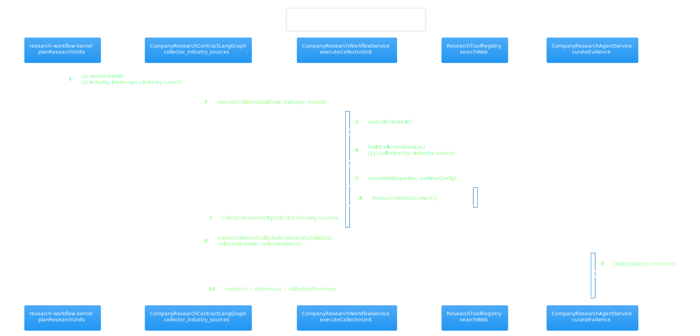

# 公司研究代码阅读导览

这份文档不是替代源码，而是帮你先建立“现在这套公司研究到底怎么跑”的心智模型，再回去读代码。

## 一句话心智模型

当前最值得关注的是 V4：`execution-service` 同时注册了 V1/V2/V3/V4 四代公司研究图，但真正更接近“合同化研究单元 + 显式采集节点 + gap loop”的，是 `CompanyResearchContractLangGraph`；它把“写 brief -> 规划 research units -> fan-out 采集 -> 证据整合 -> 补洞 -> 出报告”这条链路串起来。

## 先看这两张人工校准图

这两张图不是脚手架占位图，而是按当前源码主路径手工整理的。

### 公司研究 V4 主路径

读这张图时要抓住两点：

- V4 不是“一个大节点包办所有研究”，而是先规划 `researchUnits`，再由图里的 collector 节点显式 fan-out。
- `gapAnalysis` 不属于首轮主干采集，而是 agent4 之后的补洞循环。

### `industry_search` 实际执行链路

读这张图时把三个名字对齐：

- `industry_search`：研究单元里的 capability 名。
- `collector_industry_sources`：LangGraph 里的显式节点名。
- `industry_sources`：证据落盘到 `collectedEvidenceByCollector` 时使用的 collectorKey。

## 推荐阅读顺序

1. 先看 [LangGraph 总控页](./langgraph-company-research-graph/langgraph-company-research-graph.md)，确认你看到的是哪一代图，以及 V4 的 fan-out / join 在哪里。
2. 再看 [workflow service 热点页](./intelligence/company-research-workflow-service.md)，重点盯 `planUnits`、`runCollectorUnit`、`executeUnits`、`runGapLoop`。
3. 接着看 [kernel 热点页](./intelligence/research-workflow-kernel.md)，理解默认 `researchUnits` 是怎么规划出来的。
4. 然后看 [tool registry 热点页](./intelligence/research-tool-registry.md)，理解网页搜索、页面抓取、财务 pack 三类外部能力如何被统一封装。
5. 最后看 [agent service 热点页](./intelligence/company-research-agent-service.md)，把“证据如何打分、去重、回答问题、产出 verdict”补齐。

## 当前主路径

如果你只想先搞懂“现在的公司研究怎么跑”，按这条链路追最省时间：

1. `src/server/application/workflow/execution-service.ts:148-151`
   这里同时注册了 `LegacyCompanyResearchLangGraph`、`CompanyResearchLangGraph`、`ODRCompanyResearchLangGraph`、`CompanyResearchContractLangGraph`，说明多代图并存。
2. `src/server/infrastructure/workflow/langgraph/company-research-graph.ts:1045`
   从 `CompanyResearchContractLangGraph` 开始读 V4。
3. `src/server/infrastructure/workflow/langgraph/company-research-graph.ts:1122`
   `agent2_plan_research_units` 委托 `CompanyResearchWorkflowService.planUnits()`。
4. `src/server/infrastructure/workflow/langgraph/company-research-graph.ts:1132`
   `agent3_source_grounding` 先把官网、补充 URL、交易所披露等首批 seed 整理出来。
5. `src/server/infrastructure/workflow/langgraph/company-research-graph.ts:1172-1197`
   四个 collector 节点分别从 `researchUnits` 找 capability 对应的 unit，再调用 `executeCollectorUnit()`。
6. `src/server/application/intelligence/company-research-workflow-service.ts:358`
   `planUnits()` 先做 concept mapping、deep questions，再向 kernel 申请 `researchUnits`。
7. `src/server/application/intelligence/company-research-workflow-service.ts:393`
   `runCollectorUnit()` 是真实采集执行器，会把 capability 映射成 collectorKey，构造 query，并调用 `ResearchToolRegistry`。
8. `src/server/application/intelligence/company-research-workflow-service.ts:709`
   `executeUnits()` 按 `dependsOn` 和 `maxConcurrentResearchUnits` 分批并发执行。
9. `src/server/application/intelligence/company-research-workflow-service.ts:798`
   `runGapLoop()` 会在首轮证据整合之后压缩 findings、识别缺口、追加 follow-up units。
10. `src/server/application/intelligence/company-research-workflow-service.ts:970`
    `finalizeReport()` 才真正把 findings、verdict、confidenceAnalysis、reflection 汇成最终结果。

## `industry_search` 怎么跑

如果你关心“行业研究”这一支，直接追下面几处：

1. `src/server/application/intelligence/research-workflow-kernel.ts:421`
   `buildUnitPlanFallback()` 里默认会生成 `industry_landscape`，它的 capability 就是 `industry_search`。
2. `src/server/application/intelligence/research-workflow-kernel.ts:789`
   `planResearchUnits()` 会用大模型规划，但最终仍会裁剪到允许的 capability 集合里。
3. `src/server/infrastructure/workflow/langgraph/company-research-graph.ts:1182`
   `collector_industry_sources` 会从 `researchUnits` 中找到 `industry_search` 对应的 unit。
4. `src/server/application/intelligence/company-research-workflow-service.ts:494`
   `runCollectorUnit()` 把这个 unit 映射成 `collectorKey = industry_sources`，并生成行业格局查询词。
5. `src/server/application/intelligence/research-tool-registry.ts:117`
   `searchWeb()` 会并发搜索多个 query、按 canonical URL 去重，再把网页内容压成简短摘要。
6. `src/server/application/intelligence/company-research-agent-service.ts:1326`
   `curateEvidence()` 会把行业证据和其他 collector 的材料一起打分、去重、裁剪成最终引用集合。

## 文件职责速查

| 文件 | 你应该把它理解成什么 |
| --- | --- |
| `company-research-graph.ts` | LangGraph 编排层，决定节点、边、fan-out、pause、resume |
| `company-research-workflow-service.ts` | 公司研究应用层 orchestrator，负责研究单元执行、补洞循环、报告拼装 |
| `research-workflow-kernel.ts` | 研究规则内核，负责 task contract、brief、unit plan、gap 分析等“规则化输出” |
| `research-tool-registry.ts` | 外部能力门面，把 Firecrawl / Python intelligence / DeepSeek 摘要压缩统一起来 |
| `company-research-agent-service.ts` | 证据侧加工厂，负责 source grounding、证据打分、引用生成、问答与 verdict |

## 版本差异

| 版本 | 主要特征 | 读法建议 |
| --- | --- | --- |
| V1 | `agent4_evidence_collection` 一次性整包采集 | 只在排查最旧流程时再看 |
| V2 | 显式 `collector_*` 节点，但仍偏 collector-oriented | 想看 fan-out 雏形时再补 |
| V3 | ODR 风格，把研究单元塞进 `agent3_execute_research_units` | 适合理解“研究单元化”是怎么引入的 |
| V4 | 合同化 + 显式 fan-out + gap loop + reflection | 当前最应该优先理解的主路径 |

## 首次阅读时可以先跳过什么

- `LegacyCompanyResearchLangGraph`：除非你在定位旧模板行为。
- `CompanyResearchAgentService.collectEvidence()`：它更像 V1 的整包采集入口，不是 V4 主路径。
- 自动生成热点页里显示的“主入口”字段：它是静态启发式结果，不等于业务上真正的主执行线。

## 读完后回源码时，优先盯哪些函数

- `company-research-graph.ts`
  `CompanyResearchContractLangGraph`、`collector_industry_sources`、`agent5_gap_analysis_and_replan`
- `company-research-workflow-service.ts`
  `planUnits`、`runCollectorUnit`、`executeUnits`、`runGapLoop`、`finalizeReport`
- `research-tool-registry.ts`
  `searchWeb`、`fetchPage`、`getFinancialPack`
- `company-research-agent-service.ts`
  `groundSources`、`curateEvidence`、`answerQuestions`、`buildVerdict`

结论上可以这样记：图层决定“走哪条线”，workflow service 决定“每个研究单元怎么跑”，tool registry 决定“外部数据怎么拿”，agent service 决定“拿回来的材料怎么变成结论”。
