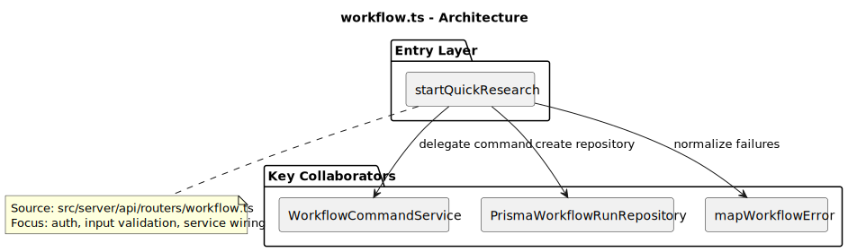
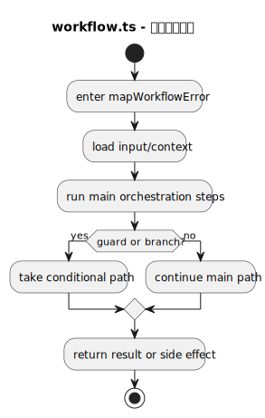
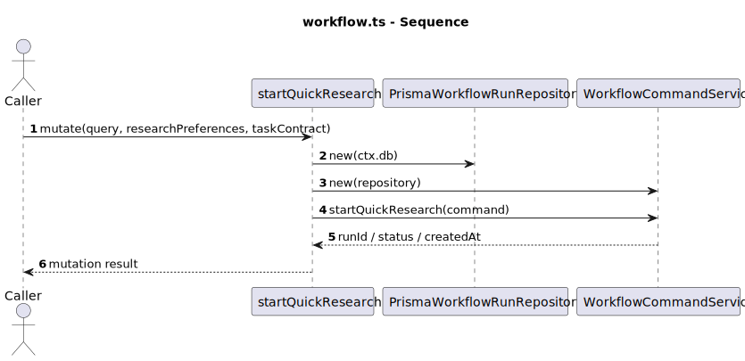
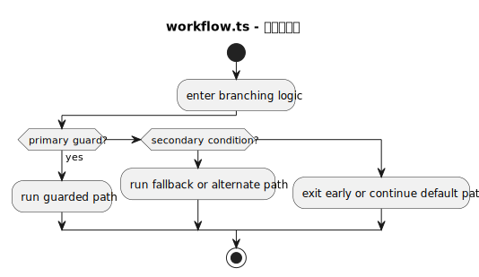
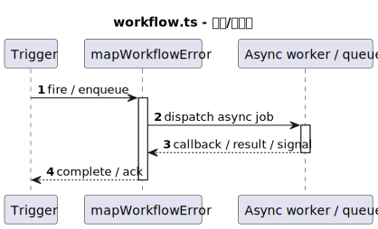

# 热点文件：workflow.ts

- 源文件: `src/server/api/routers/workflow.ts`
- 热点分数: `56`
- 主入口: `startQuickResearch`
- 触发原因: `主编排函数存在 >= 5 个顺序步骤 (assertTimingPresetExists calls=5)`

这份文件是工作流 bounded context 的 tRPC 入口层。对行业研究链路来说，最重要的职责不是“执行业务”，而是把外部请求安全、规范地转成应用层命令，并把领域异常映射成前端可理解的 HTTP / tRPC 错误。

## 职责说明

`startQuickResearch` 是行业研究请求进入服务端的第一站，它在 [src/server/api/routers/workflow.ts](../../src/server/api/routers/workflow.ts) 里完成鉴权、Zod 参数校验，并创建 `PrismaWorkflowRunRepository` 与 `WorkflowCommandService`。这个文件本身不承载研究策略，也不执行 LangGraph，只负责入口编排、资源存在性检查和统一错误出口。

如果把工作流系统看成分层架构，这里就是“应用层入口适配器”：它把 HTTP / tRPC 世界中的 session、input、TRPCError，翻译成应用层可以处理的命令对象。

## 复杂度证据

- 主要复杂函数: `assertTimingPresetExists`, `mapWorkflowError`, `TRPCError`
- 结构复杂性: `22/45`
- 协作复杂性: `4/20`
- 异步/并发复杂性: `15/20`
- 编排角色提示: `15/15`

## 图列表

### 架构图

### 主流程活动图

### 协作顺序图

### 分支判定图

### 异步/并发图

## 关键结论

- 协作者: `protectedProcedure`、`PrismaWorkflowRunRepository`、`WorkflowCommandService`、`WorkflowQueryService`、`TRPCError`
- 输入: `query`、可选 `researchPreferences`、可选 `taskContract`、`templateVersion`、`idempotencyKey`
- 输出: 行业研究启动会返回 `runId`、`status`、`createdAt`；查询接口返回 run 详情或列表
- 风险分支: 资源不存在、模板不存在、状态非法、领域错误与未知错误需要被 `mapWorkflowError` 正确降级
- 异步/状态注意点: 这里不会真正推进工作流状态，只做异步 DB / service 调用；真实状态迁移发生在 `command-service.ts` 与 `execution-service.ts`

## 阅读提示

- 先看 `mapWorkflowError()`，理解领域错误如何映射到前端体验。
- 再看 `startQuickResearch`，它就是“行业研究工作流入口”的最短阅读路径。
- 其他 mutation 复用同一套模式，因此这个文件也定义了工作流模块的统一入口风格。
