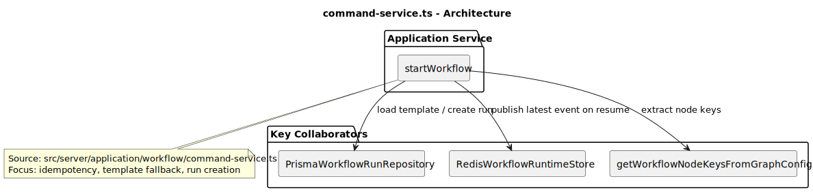
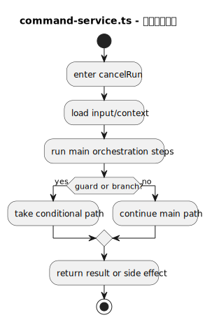
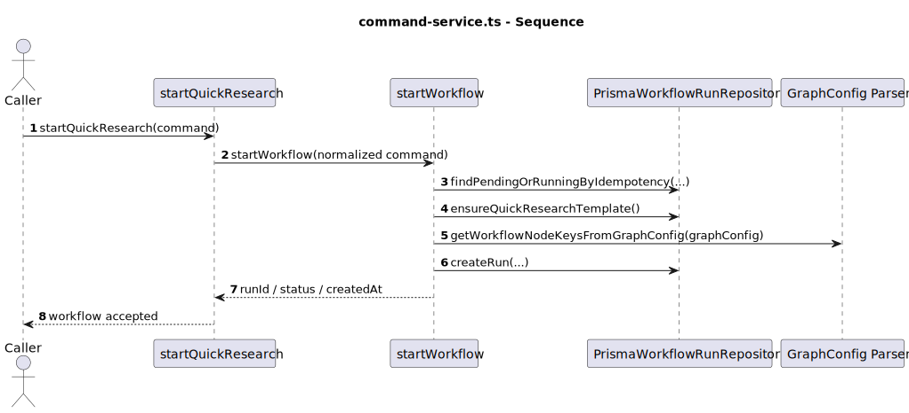
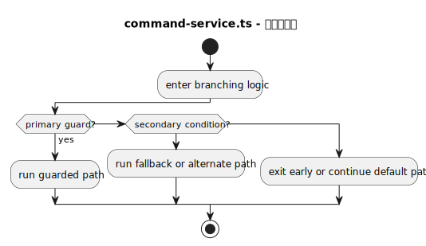
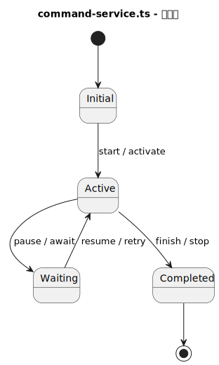
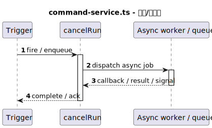

# 热点文件：command-service.ts

- 源文件: `src/server/application/workflow/command-service.ts`
- 热点分数: `81`
- 主入口: `startQuickResearch` / `startWorkflow`
- 触发原因: `峰值函数圈复杂度 >= 10 (startWorkflow=28); 嵌套深度 >= 4 且判定点 >= 6 (startWorkflow: nesting=4, decisions=27); 主编排函数存在 >= 5 个顺序步骤 (startWorkflow calls=26)`

这个文件是工作流应用层的“命令总线外观”。行业研究链路虽然从 `startQuickResearch()` 进入，但真正值得理解的是内部的 `startWorkflow()`：它把不同模板的启动请求压平成统一的 run 创建流程，并负责模板版本兜底、幂等保护与节点列表初始化。

## 职责说明

对行业研究来说，`startQuickResearch()` 只是把 query、研究偏好和 task contract 包装成统一命令，然后委托给 `startWorkflow()`。`startWorkflow()` 会先按幂等键查重，再确保模板存在且版本够新，然后从模板 `graphConfig` 中提取节点列表，最后创建一条 `PENDING` workflow run 记录。

这个文件还承担“运行状态入口控制”的角色，例如取消运行、审批恢复和事件发布。但这些能力仍停留在应用层边界，它不直接执行图，只为执行层准备好足够稳定、可恢复的运行上下文。

## 复杂度证据

- 主要复杂函数: `startWorkflow`, `mapEventType`, `WorkflowDomainError`
- 结构复杂性: `40/45`
- 协作复杂性: `13/20`
- 异步/并发复杂性: `13/20`
- 编排角色提示: `15/15`

## 图列表

### 架构图

### 主流程活动图

### 协作顺序图

### 分支判定图

### 状态图

### 异步/并发图

## 关键结论

- 协作者: `PrismaWorkflowRunRepository`、`RedisWorkflowRuntimeStore`、`getWorkflowNodeKeysFromGraphConfig()`、模板 `ensure*Template()` 系列方法
- 输入: 行业研究主输入是 `query`、`researchPreferences`、`taskContract`，以及可选 `templateVersion` 与 `idempotencyKey`
- 输出: 新 run 的 `runId`、`status`、`createdAt`；恢复审批路径会更新 checkpoint、run 状态和事件流
- 风险分支: 幂等键命中时直接返回旧 run；模板缺失会触发 `ensureQuickResearchTemplate()`；`graphConfig` 没有节点会阻止创建；审批恢复依赖 Redis checkpoint 存在
- 异步/状态注意点: 这里创建的是“待执行状态”，不是同步执行结果；行业研究默认模板版本会被兜底到较新版本，因此它直接影响后续执行会落到 v1/v2/v3 中的哪一套图

## 行业研究链路重点

- `startQuickResearch()` 在 `command-service.ts:175`，是行业研究专用入口。
- `startWorkflow()` 在 `command-service.ts:428`，是所有模板共用的核心分支点。
- 对 `quick_industry_research`，未显式指定 `templateVersion` 时会优先执行 `ensureQuickResearchTemplate()`，这是“默认走最新研究图”的关键来源。
- 创建 run 前会用 `getWorkflowNodeKeysFromGraphConfig()` 抽节点，这让模板配置和执行层之间形成了清晰边界。

## 阅读提示

- 如果你只想知道“为什么点了发起行业研究后数据库里会先出现一条运行记录”，先看 `startQuickResearch()` 和 `startWorkflow()`。
- 如果你想理解暂停恢复是怎么接回前端事件流的，再看 `approveScreeningInsights()` 和 `publishLatestEvent()`。
