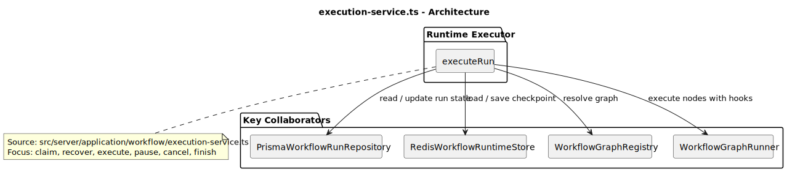
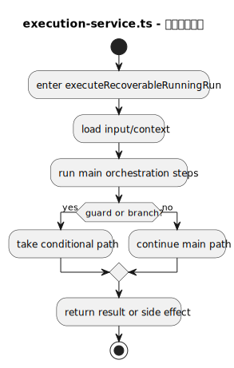
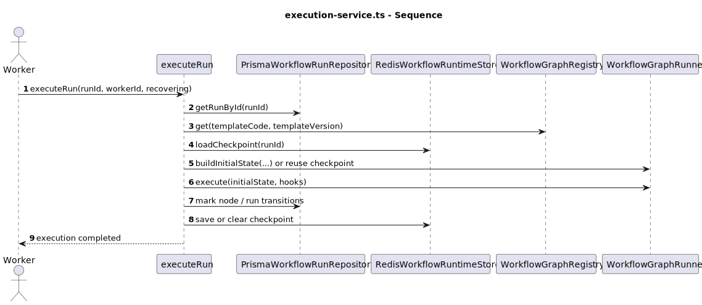
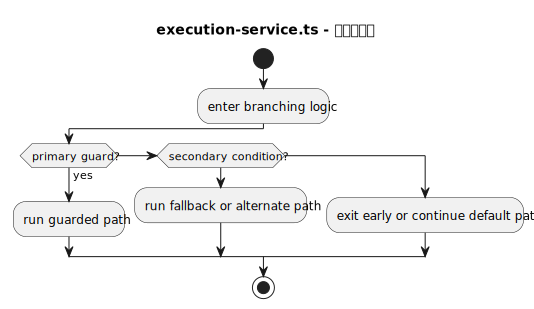
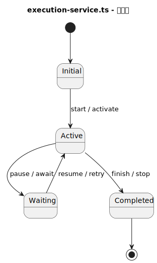
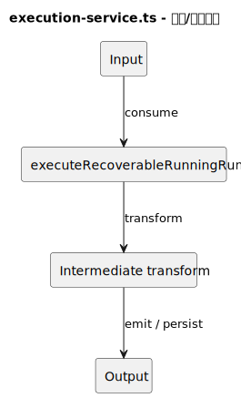

# 热点文件：execution-service.ts

- 源文件: `src/server/application/workflow/execution-service.ts`
- 热点分数: `76`
- 主入口: `executeNextPendingRun` / `executeRun`
- 触发原因: `峰值函数圈复杂度 >= 10 (mapEventType=12); 显式状态/生命周期复杂 (0 states, 14 transitions); 主编排函数存在 >= 5 个顺序步骤 (mapEventType calls=19)`

这个文件是工作流系统真正的运行时执行器。命令服务只会创建 run，而这里负责把 run 领取出来、解析到具体图实现、执行节点、保存 checkpoint，并在成功、失败、取消、暂停之间完成状态迁移。

## 职责说明

`createWorkflowExecutionService()` 会组装行业研究真正依赖的服务对象，例如 `QuickResearchWorkflowService`、`IntelligenceAgentService` 以及三代 quick research graph runner。`executeNextPendingRun()` 用于从队列里领取新 run，`executeRecoverableRunningRun()` 用于恢复中断运行，而 `executeRun()` 则承载了最核心的状态机逻辑。

对于行业研究工作流来说，这个文件决定了“节点执行的副作用写到哪里去”。数据库里的 node runs、Redis checkpoint、事件流发布，以及取消和暂停的处理，全部在这里汇合。

## 复杂度证据

- 主要复杂函数: `mapEventType`, `RunCancelledError`, `WorkflowDomainError`
- 结构复杂性: `39/45`
- 协作复杂性: `14/20`
- 异步/并发复杂性: `8/20`
- 编排角色提示: `15/15`

## 图列表

### 架构图

### 主流程活动图

### 协作顺序图

### 分支判定图

### 状态图

### 数据/依赖流图

## 关键结论

- 协作者: `WorkflowGraphRegistry`、`PrismaWorkflowRunRepository`、`RedisWorkflowRuntimeStore`、各类 LangGraph runner、节点 hook 回调
- 输入: worker 抢到的 `runId`、模板 code/version、checkpoint、node runs、graph 初始状态
- 输出: run / node run 状态更新、checkpoint 保存或清理、最新事件发布、最终结果持久化
- 风险分支: 运行前取消、运行中取消、节点跳过、`WorkflowPauseError` 暂停、节点失败、恢复时找不到 checkpoint 或 nodeRun 记录
- 异步/状态注意点: 真实状态分散在内存 `state`、Redis checkpoint、DB node runs 三处；恢复不是简单继续，而是“checkpoint + 已完成节点输出回放”联合重建

## 行业研究链路重点

- `createWorkflowExecutionService()` 在 `execution-service.ts:92`，明确注册了 `QuickResearchLangGraph`、`QuickResearchODRLangGraph` 和 `QuickResearchContractLangGraph`。
- `executeNextPendingRun()` 在 `execution-service.ts:204`，是新任务启动入口。
- `executeRun()` 在 `execution-service.ts:216`，会先通过 `WorkflowGraphRegistry.get()` 决定本次行业研究到底执行哪个版本的图。
- `restoreStateFromCompletedNodeRuns()` 在 `execution-service.ts:520`，解释了为什么暂停恢复和 worker 中断后仍能继续。

## 阅读提示

- 先看 `executeRun()` 前半段，理解“run -> graph -> initialState / checkpoint”的装配过程。
- 再看 `hooks`，这是数据库 node runs 和前端实时事件的来源。
- 最后看 `catch` 分支，取消、暂停、失败三种结局的差异都在这里。
