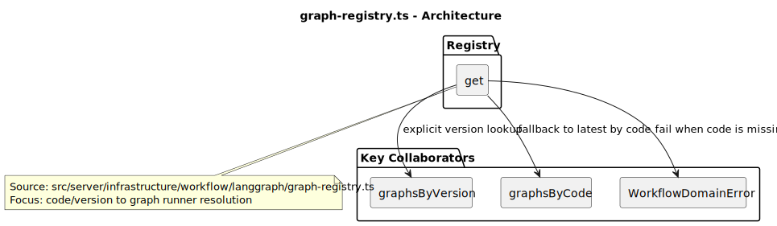
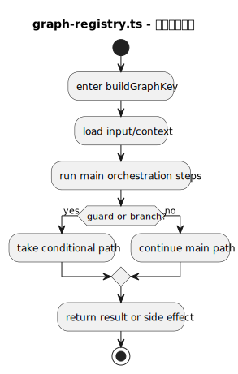
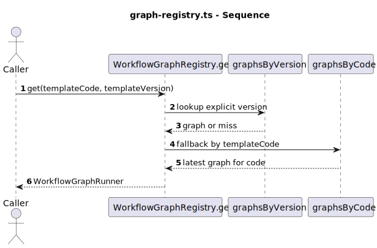
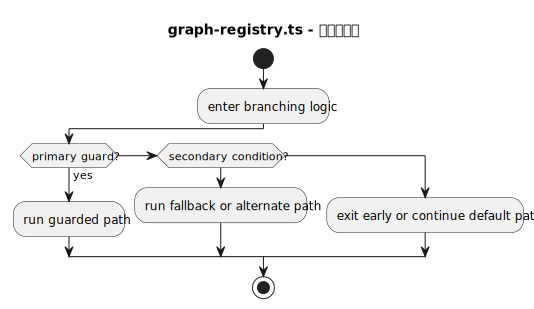
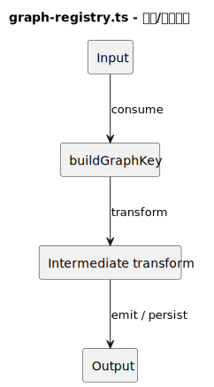

# 热点文件：graph-registry.ts

- 源文件: `src/server/infrastructure/workflow/langgraph/graph-registry.ts`
- 热点分数: `55`
- 主入口: `get`
- 触发原因: `嵌套深度 >= 4 且判定点 >= 6 (buildGraphKey: nesting=4, decisions=7); 主编排函数存在 >= 5 个顺序步骤 (buildGraphKey calls=18)`

这个文件很短，但它是模板版本和真实执行图之间的关键接缝。行业研究默认走哪一代 LangGraph，不是在 router 里决定的，而是在这里根据 `templateCode` 和 `templateVersion` 解析出来。

## 职责说明

构造函数会把传入的 graph runners 同时注册到两个索引中：一个是“按 code 精确到 version”的映射，另一个是“同一 code 的默认最新版本”映射。`get()` 则先尝试按显式版本命中，如果没命中再回退到同 code 的默认图。

对行业研究而言，这个策略直接决定 `quick_industry_research` 会落到 v1、v2 还是 v3。也正因为它会记录“同 code 下最高版本”为默认值，所以命令服务里的模板版本兜底策略才会真正生效。

## 复杂度证据

- 主要复杂函数: `buildGraphKey`, `WorkflowDomainError`
- 结构复杂性: `32/45`
- 协作复杂性: `13/20`
- 异步/并发复杂性: `0/20`
- 编排角色提示: `10/15`

## 图列表

### 架构图

### 主流程活动图

### 协作顺序图

### 分支判定图

### 数据/依赖流图

## 关键结论

- 协作者: `WorkflowGraphRunner[]`、`WorkflowDomainError`
- 输入: `templateCode`、可选 `templateVersion`
- 输出: 一个可执行的 graph runner 实例
- 风险分支: 如果显式版本未命中，但同 code 有其他版本，`get()` 会回退到默认最新版本；只有 code 本身不存在时才抛 `WORKFLOW_TEMPLATE_NOT_FOUND`
- 异步/状态注意点: 这里没有异步状态，但它决定后续执行层会拿到哪一套状态机定义

## 行业研究链路重点

- 行业研究模板 code 固定是 `quick_industry_research`。
- 执行层把数据库里的 `template.code` 与 `template.version` 传进 `get()`，因此“数据库模板版本”和“注册表最新版本”会共同影响最终图实现。
- 这也是排查“为什么同样是行业研究，不同 run 的节点顺序不一样”时最先该看的文件。
