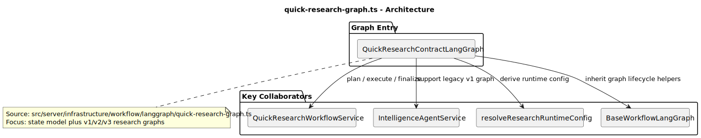
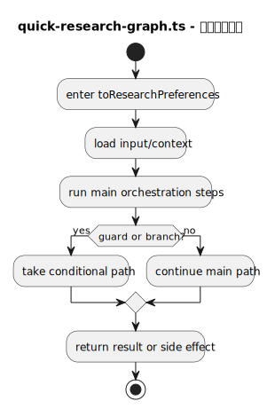
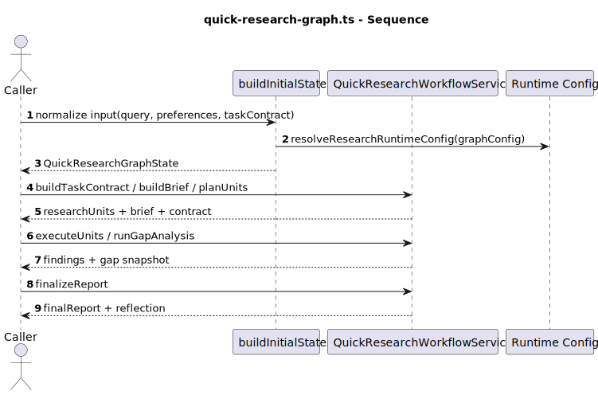
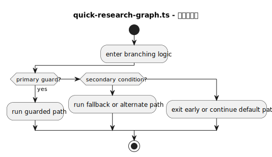
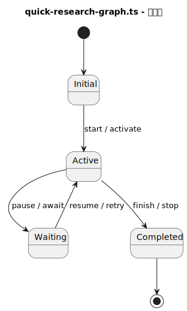
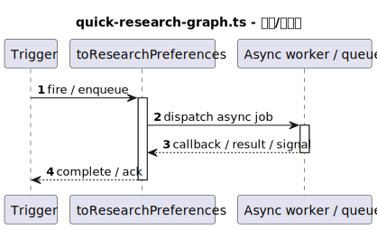
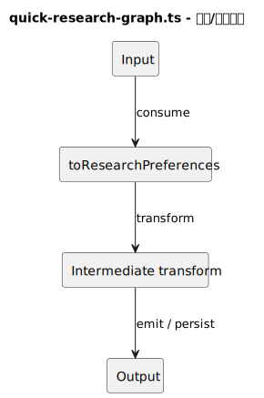

# 热点文件：quick-research-graph.ts

- 源文件: `src/server/infrastructure/workflow/langgraph/quick-research-graph.ts`
- 热点分数: `77`
- 主入口: `QuickResearchContractLangGraph`
- 触发原因: `峰值函数圈复杂度 >= 10 (WorkflowPauseError=22); 嵌套深度 >= 4 且判定点 >= 6 (WorkflowPauseError: nesting=6, decisions=21); 显式状态/生命周期复杂 (1 states, 30 transitions)`

这个文件是行业研究工作流的核心语义载体。它不只是“定义几个节点”，而是完整声明了行业研究图的状态结构、输入归一化方式、三代模板实现，以及每个节点执行后应该怎样向执行层暴露输出摘要和事件载荷。

## 职责说明

`QuickResearchLangGraphBase` 统一处理初始状态构造、节点输出合并和最终结果提取；`toResearchPreferences()` 与 `toResearchInput()` 负责把入口输入收敛成图能消费的结构化状态。其上叠加了三代行业研究图：v1 是线性五段式流程，v2 引入澄清、规划、缺口分析和最终收敛，v3 则进一步按能力拆分趋势分析、候选筛选、可信度与竞争分析，并补上 reflection 与 contract score。

从“业务理解成本”来看，v3 才是当前最值得读的实现，因为它代表行业研究默认路径，而且把 task contract、runtime config、unit 规划与 gap analysis 全部串到了一个状态机里。

## 复杂度证据

- 主要复杂函数: `WorkflowPauseError`, `WorkflowPauseError`, `selectUnitsByCapabilities`
- 结构复杂性: `41/45`
- 协作复杂性: `14/20`
- 异步/并发复杂性: `12/20`
- 编排角色提示: `10/15`

## 图列表

### 架构图

### 主流程活动图

### 协作顺序图

### 分支判定图

### 状态图

### 异步/并发图

### 数据/依赖流图

## 关键结论

- 协作者: `QuickResearchWorkflowService`、`IntelligenceAgentService`、`BaseWorkflowLangGraph`、`resolveResearchRuntimeConfig()`、`parseResearchTaskContract()`
- 输入: `query`、`researchPreferences`、`taskContract`、模板 `graphConfig`、执行层传入的 run 元信息
- 输出: 节点级局部状态、节点事件 payload、最终 `finalReport`
- 风险分支: 范围不清时会抛 `WorkflowPauseError` 暂停；能力过滤后若某类 research unit 为空，会出现“节点成功但实质无输出”；gap analysis 可能回写研究笔记、单元运行记录与 replan 轨迹
- 异步/状态注意点: 图内部状态是累积式的，单个节点可能同时更新业务数据、反思信息和运行时配置影子；真正的 checkpoint 持久化由执行层在节点成功或跳过后完成

## 三代图的阅读重点

- `QuickResearchLangGraph`: 偏“传统五代理流水线”，适合快速了解最早的行业研究形态。
- `QuickResearchODRLangGraph`: 开始引入澄清范围、研究 brief、研究单元执行与 gap analysis，是从线性流程走向可恢复研究编排的过渡版。
- `QuickResearchContractLangGraph`: 当前默认主实现。先抽研究规格，再按 capability 执行不同 research units，最后做报告综合和 reflection。

## 当前默认路径

- `buildInitialState()` 会把模板 `graphConfig` 解析成 runtime config，因此模板配置可以调整并发、轮次和证据上限。
- v3 的节点顺序对应 `QUICK_RESEARCH_V3_NODE_KEYS`，核心语义是：
  - `agent0_clarify_scope`: 是否需要补充范围
  - `agent1_extract_research_spec`: 生成 task contract、brief 和研究单元
  - `agent2_trend_analysis`: 执行主题概览与市场热度
  - `agent3_candidate_screening`: 执行标的筛选
  - `agent4_credibility_and_competition`: 做可信度、竞争格局和缺口分析
  - `agent5_report_synthesis`: 压缩发现并形成最终报告
  - `agent6_reflection`: 抽取 contract score、quality flags 和缺失项

## 阅读提示

- 先看 `buildInitialState()`，理解输入是怎样变成图状态的。
- 再看 `QuickResearchContractLangGraph`，这是当前主路径。
- 如果你在排查“为什么 run 被暂停”，重点看两个 `WorkflowPauseError` 抛出位置。
